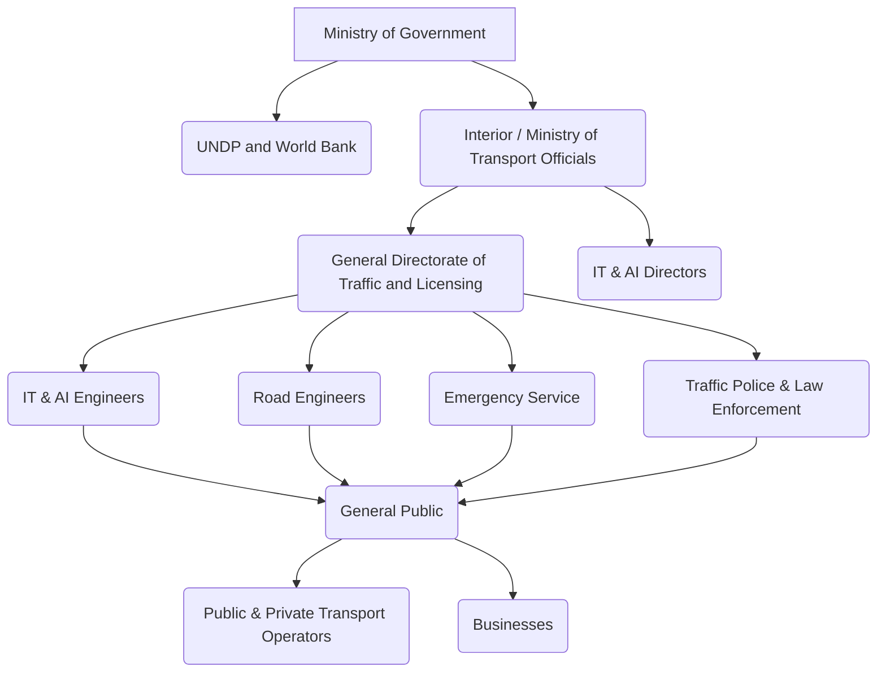

# Smart Trafficking (MS) Powered by AI

## Overview

This repository contains an analysis of a Smart Trafficking Management System (STMS) powered by Artificial Intelligence (AI). The document outlines the problem statement, system capabilities, benefits, organizational structure, user classifications, interview insights, user stories, use cases, CRUD operations, system scenarios, and detailed functional and non-functional requirements.

## Table of Contents

- [Problem Description](#problem-description)
- [System Capabilities](#system-capabilities)
- [System Benefits](#system-benefits)
- [Organization Chart](#organization-chart)
- [Classifying Users](#classifying-users)
- [Interviews](#interviews)
- [User Stories](#user-stories)
- [Use Cases](#use-cases)
- [CRUD Operations](#crud-operations)
- [System Scenario](#system-scenario)
- [Requirements](#requirements)

## Problem Description

Urban areas worldwide are experiencing increasing traffic congestion, leading to significant challenges for commuters, emergency services, and city authorities. Traditional traffic management systems rely on fixed signal timings and outdated infrastructure, which are insufficient to handle dynamic traffic patterns effectively.

## System Capabilities

The Smart Trafficking Management System (STMS) offers the following key capabilities:

1.  **Dynamic Traffic Signal Control:** Automatically adjusts signal timings based on real-time traffic density.
2.  **Real-Time Traffic Monitoring and Analysis:** Collects live data using IoT sensors and CCTV cameras, and analyzes traffic flow patterns to detect anomalies.
3.  **Accident Detection and Emergency Response Coordination:** Detects accidents using computer vision technology and coordinates emergency responses.
4.  **Smart Parking Guidance:** Displays real-time parking availability and directs drivers to the nearest vacant parking spots.
5.  **Mobile App Integration:** Provides real-time traffic updates, accident alerts, route recommendations, and voice-guided navigation with dynamic route changes.

## System Benefits

The implementation of the STMS yields numerous benefits:

1.  **Reduced Traffic Congestion:** Smoother traffic flow and shorter commute times due to dynamic traffic lights reducing waiting times at intersections.
2.  **Enhanced Road Safety:** Real-time accident detection enables faster emergency response, and adaptive traffic signals reduce collision risks.
3.  **Improved Commuter Experience:** Accurate route suggestions and reduced travel frustration, with real-time updates via the mobile app for better journey planning.
4.  **Public Safety and Security:** Dynamic signal control and accident detection decrease collision rates, and priority signaling for emergency vehicles ensures faster response times.
5.  **Government Reporting & Compliance:** Automated reports on traffic flow, congestion, and incidents assist policymakers in infrastructure planning and ensure compliance with government regulations.
6.  **Public Traffic Information Access:** Delivers live traffic updates, road closures, and accident alerts via web and mobile platforms, helping commuters plan efficient routes.
7.  **Accident Reporting & Response:** Detects accidents through AI-powered monitoring, sensors, or connected vehicles, triggering immediate alerts and notifying emergency services with precise location details.

## Organization Chart

The following chart illustrates the organizational structure involved in the Smart Trafficking Management System:

## Classifying Users

Users of the STMS are classified into the following categories:

-   **Operational Executive:** General Directorate of Traffic and Licensing, Ministry of Interior/Transportation Officials.
-   **Internal:** IT & AI Engineers, IT & AI Directors, Road Engineers, Traffic Police & Law Enforcement.
-   **External:** Government Ministries (Interior, Public Works, etc.), Emergency Services, Public & Private Transport Operators, General Public, UNDP, World Bank, Teleyemen.

## Interviews

Interviews were conducted with various stakeholders to gather insights into the challenges and expectations for the Smart Traffic Management System. Key findings from these interviews are summarized below.

### Interview with Officer Ahmed Saeed Al-Mansouri (Traffic Police Officer)

**Objectives:** To understand traffic management challenges, current systems, and expectations for the Smart Traffic Management System.

**Key Takeaways:**
-   **Challenges:** Heavy congestion during peak hours, lack of real-time data for decision-making, outdated infrastructure, and difficulty in coordinating with emergency services during incidents.
-   **Current Systems:** Somewhat effective but limited; fixed signal timings and outdated infrastructure cannot adapt to dynamic traffic conditions or unexpected incidents.
-   **Advanced Technologies (AI, IoT):** Can provide real-time monitoring, predictive analytics, and adaptive signaling, significantly reducing congestion and improving response times.
-   **Expected Features:** Adaptive traffic signals, real-time incident alerts, emergency vehicle prioritization, pedestrian safety enhancements, and integration with connected vehicles.
-   **Incident Handling:** Currently relies on manual interventions, which are often slow and lack coordination.
-   **Emergency Vehicle Prioritization:** Would ensure faster response times by creating green waves for ambulances, fire trucks, and police vehicles.
-   **Driver Role:** Drivers often disregard traffic rules, make sudden stops, or fail to yield, exacerbating congestion and increasing accident risk.
-   **Public Awareness:** Educating drivers about smart systems, safe driving practices, and compliance can reduce human errors and improve overall traffic flow.
-   **Usability and Reliability:** The system should be user-friendly, reliable, and capable of handling large-scale data without interruptions, providing actionable insights to officers.
-   **Impact on Urban Mobility:** Expected to reduce congestion, enhance safety, and provide smoother traffic flow, ultimately improving quality of life.
-   **Personal Impact:** Would provide real-time data for quicker incident response and reduce manual work, making the job easier and improving traffic safety.

### Interview with Abdulkarim Mohammed Aljunaid (General Public/Driver)

**Objectives:** To understand the daily challenges drivers face in Yemen’s traffic conditions, explore how the STMS can address signal outages, lack of infrastructure, and limited real-time data, and gather realistic expectations for the STMS in Yemen’s context.

**Key Takeaways:**
-   **Challenges:** Frequent signal outages, chaotic intersections, drivers not following rules, lack of traffic management systems, and parking difficulties.
-   **Navigation without Signals:** Chaotic, leading to arguments and accidents; traffic police are not always present.
-   **AI-powered Traffic Management:** Would be amazing if it can manage intersections without physical signals, works during power outages, and is simple to understand.
-   **Real-time Traffic Data:** Currently relies on word-of-mouth; real-time updates would be trusted if accurate and works offline.
-   **Emergency Handling:** Quick detection and rerouting for accidents/roadblocks would be a game-changer.
-   **Smart Parking:** Would use it if it shows real-time parking, even if a bit far, but needs to work without fancy sensors or cameras.
-   **Encouraging Compliance:** Suggested rewards (e.g., fuel discounts for safe driving) and penalties (reporting reckless drivers).
-   **Operational during Power Outages:** Needs backup power (solar, batteries) and offline functionality (SMS alerts).
-   **Biggest Concern:** That the system won’t be adapted to Yemen’s reality (limited infrastructure, resources); needs to be simple and affordable.

### Interview with Mohammed Yasin Al-Matrai (Emergency Traffic Dispatcher)

**Objectives:** To understand the challenges faced by emergency traffic dispatchers during major incidents, assess current communication and coordination methods, and gather realistic expectations for integrating the STMS into emergency dispatch operations.

**Key Takeaways:**
-   **Critical Challenges:** Managing real-time communication across multiple emergency services, outdated infrastructure hindering data flow, and unexpected power outages disrupting coordination channels.
-   **Current Communication:** Combination of radio, mobile networks, and manual coordination, often resulting in delays and miscommunications.
-   **Lack of Real-time Data:** Leads to slower response times and increased risks due to inability to assess incident severity and allocate resources efficiently.
-   **Advanced Technologies (AI, IoT):** Can instantly analyze traffic patterns, predict incidents, enhance situational awareness, and dynamically reroute emergency vehicles.
-   **Prioritized Features:** Real-time incident alerts, automated coordination, backup communication channels, and integrated navigation aids for optimized routing.
-   **Impact of Improved Technology:** Could have streamlined communication and reduced response times in past incidents.
-   **Managing Power Outages:** Contingency plans exist but are cumbersome; an integrated system with offline mode would greatly improve efficiency.
-   **Public Awareness:** Vital for supporting emergency response; can be improved through community outreach and real-time public notifications.
-   **Training and Resources:** Ongoing training in new technologies, regular simulations, user-friendly interfaces, robust technical support, and clear SOPs are necessary.
-   **Transforming Role:** Shift from reactive crisis management to proactive and strategic coordination, reducing delays and improving public safety.

### Interview with Ameen Ali Al-Daroani (Teleyemen Representative)

**Objectives:** To clarify Teleyemen’s role, address Yemen-specific challenges, explore technical collaboration, assess cybersecurity measures, highlight public impact, gauge long-term vision, and strengthen stakeholder alignment.

**Key Takeaways:**
-   **Infrastructure Provision:** Providing backbone connectivity (fiber-optic networks, 4G/LTE coverage) for traffic sensors, AI servers, and control centers, including solar-powered telecom towers for unstable power areas.
-   **Ensuring Reliability:** Implemented redundant power systems (solar, backup generators) and burying fiber-optic cables in conflict-prone zones; partnering with local authorities for security.
-   **Collaboration with IT/AI Teams:** Close work with Ministry of Transport’s IT team for low-latency network architecture, dedicated bandwidth for traffic data, and testing edge computing solutions.
-   **Cybersecurity Measures:** Multi-layered security framework with end-to-end encryption, firewalls, intrusion detection systems, regular audits with UNDP, and training government IT staff.
-   **Biggest Challenges:** Infrastructure limitations (outdated, requires investment) and ongoing conflict (security risks for personnel and equipment).
-   **Impact on Urban Mobility:** Will significantly improve urban mobility by reducing congestion, enhancing safety, optimizing traffic flow, and providing valuable data for urban planning.
-   **Long-term Role:** Primary connectivity provider, expanding and maintaining network infrastructure, collaborating with research institutions for new AI-powered solutions, and integrating emerging technologies like 5G and V2X.

### Interview with Colonel Ali Al-Shami (Ministry of Interior Official)

**Objectives:** To clarify the Ministry’s strategic role in deploying Yemen’s STMS, focusing on its responsibilities in policy enforcement, infrastructure integration, and multi-agency collaboration.

**Key Takeaways:**
-   **Primary Role:** Oversees national traffic policies, ensuring road safety and efficient transportation, including managing regulations, enforcement, and coordinating with agencies.
-   **Integration into Existing Infrastructure:** Seamless incorporation by upgrading current infrastructure, installing advanced traffic control devices, and ensuring compatibility with existing systems.
-   **Anticipated Benefits:** Enhanced traffic flow, reduced congestion, improved road safety, proactive traffic management, and quicker response to incidents.
-   **Collaboration with General Directorate of Traffic and Licensing:** Close work for seamless integration with existing enforcement and vehicle registration systems, sharing data, aligning procedures, and jointly developing protocols.
-   **Foreseen Challenges:** Ensuring interoperability, securing funding for upgrades, and training personnel.
-   **Collaboration with Other Stakeholders:** Establishment of a coordination committee with local governments, law enforcement, technology partners, and community organizations.
-   **Coordination with Local Municipalities:** Establishing communication channels to address local challenges, customize solutions, and meet unique needs.
-   **Collaboration with Ministry of Finance:** Engaging to secure funding through detailed budget proposals, outlining economic benefits, and exploring financing options.
-   **Projected Timeline:** Phased implementation: 12-month pilot, followed by gradual expansion over two to three years.
-   **Measuring Success:** Reduced traffic congestion, lower accident rates, improved emergency response times, and positive public feedback.

### Interview with Dr. Ahmed Al-Jabri (Academic/AI and Urban Planning Expert)

**Objectives:** To understand the academic perspective on AI and its application in traffic management, explore potential research collaborations, and gather insights on ethical considerations and societal impact.

**Key Takeaways:**
-   **AI Advancements:** Offers unprecedented opportunities to optimize traffic flow, predict congestion, and enhance safety through machine learning algorithms analyzing vast data.
-   **Ethical Considerations:** Data privacy (anonymization), algorithmic bias (avoiding discrimination), and transparency in decision-making are paramount.
-   **Academic Contributions:** Research and development (robust AI algorithms, sensor placement, simulation models), and training future engineers and data scientists.
-   **Long-term Societal Impacts:** Improved urban mobility, reduced pollution, enhanced quality of life, fostered economic growth; potential job displacement needs consideration.
-   **Adaptation to Yemen:** Must prioritize offline functionality, low-cost solutions, and community engagement, considering Yemen’s specific infrastructure and cultural norms.
-   **Challenges in Integration:** Complex with outdated infrastructure; data compatibility, sensor interoperability, legacy system integration, and cybersecurity threats.
-   **Measuring Success:** Reduced congestion times, fewer accidents, improved emergency response times, and increased public satisfaction; regular audits and data analysis are essential.
-   **International Collaborations:** Crucial for funding, technical expertise, capacity-building, knowledge transfer, and establishing best practices.
-   **Research Areas:** AI algorithms robust to data scarcity/unreliable inputs, explainable AI for trust/accountability, and decentralized AI approaches.
-   **Public Acceptance:** Requires engagement, education, and data protection; involving local communities fosters trust.

## User Stories

User stories capture the perspectives and needs of various stakeholders interacting with the Smart Traffic Management System (STMS).

-   **As a citizen,** I want to travel safely and efficiently through the city, so that I can reach my destination without unnecessary delays or risks.
-   **As a traffic police officer,** I want to manage traffic flow effectively and respond quickly to incidents, so that I can ensure public safety and maintain order on the roads.
-   **As an emergency service provider (e.g., ambulance, fire department),** I want to reach emergency sites rapidly and safely, so that I can provide timely assistance and save lives.
-   **As a city planner,** I want to analyze traffic patterns and make data-driven decisions, so that I can optimize urban infrastructure and improve overall mobility.
-   **As a public transport operator,** I want to ensure timely and efficient movement of buses and other vehicles, so that I can provide reliable services to commuters.
-   **As a business owner,** I want to ensure smooth logistics and timely delivery of goods, so that I can maintain efficient operations and customer satisfaction.
-   **As a government official,** I want to monitor traffic performance and ensure compliance with regulations, so that I can make informed policy decisions and improve urban governance.
-   **As a tourist,** I want to navigate the city easily and discover attractions, so that I can enjoy my visit without getting lost or stuck in traffic.
-   **As a pedestrian,** I want to cross streets safely and access public spaces conveniently, so that I can move around the city without fear of accidents.
-   **As a cyclist,** I want to ride safely on designated lanes and avoid congested areas, so that I can commute healthily and efficiently.
-   **As a delivery driver,** I want to find the fastest routes and parking spots, so that I can deliver packages promptly and efficiently.
-   **As a student,** I want to commute to school or university without delays, so that I can attend classes on time and focus on my studies.
-   **As a resident,** I want to have a peaceful and safe neighborhood, so that I can enjoy a high quality of life without excessive traffic noise or pollution.
-   **As a parent,** I want to ensure my children’s safety during their commute to school, so that I can have peace of mind.
-   **As a taxi driver,** I want to optimize my routes and pick-up/drop-off points, so that I can maximize my earnings and provide efficient service.
-   **As a construction worker,** I want to transport materials and equipment efficiently, so that I can complete projects on time and within budget.
-   **As a researcher,** I want to access real-time traffic data and analyze patterns, so that I can contribute to academic studies and develop innovative solutions.
-   **As a traffic engineer,** I want to design and implement efficient traffic systems, so that I can improve urban mobility and reduce congestion.
-   **As an environmental activist,** I want to reduce carbon emissions and promote sustainable transport, so that I can contribute to a healthier planet.
-   **As a data analyst,** I want to process and visualize traffic data, so that I can provide insights for decision-making and urban planning.
-   **As a software developer,** I want to build and integrate traffic management applications, so that I can contribute to smart city initiatives.
-   **As a cybersecurity expert,** I want to secure traffic data and systems, so that I can protect against cyber threats and ensure system integrity.
-   **As a maintenance technician,** I want to monitor and repair traffic infrastructure, so that I can ensure system reliability and minimize downtime.
-   **As a public relations officer,** I want to communicate traffic updates and system benefits, so that I can keep the public informed and engaged.
-   **As a legal advisor,** I want to ensure compliance with traffic laws and regulations, so that I can maintain public order and safety.
-   **As a financial manager,** I want to optimize resource allocation and budget for traffic projects, so that I can ensure financial sustainability.
-   **As a human resources manager,** I want to recruit and train skilled personnel for traffic management, so that I can build a competent workforce.
-   **As a logistics manager,** I want to optimize supply chain efficiency and reduce transportation costs, so that I can improve business operations.
-   **As a healthcare professional,** I want to ensure timely access to medical facilities, so that I can provide urgent care and save lives.
-   **As a social worker,** I want to ensure equitable access to transportation for all citizens, so that I can promote social inclusion and reduce disparities.
-   **As a media professional,** I want to report on traffic conditions and urban development, so that I can inform the public and raise awareness.
-   **As a civil engineer,** I want to design and build sustainable urban infrastructure, so that I can improve city resilience and livability.
-   **As a community leader,** I want to advocate for improved traffic solutions, so that I can enhance the quality of life for my constituents.
-   **As a police chief,** I want to ensure effective law enforcement and public safety, so that I can maintain order and reduce crime.
-   **As a mayor,** I want to implement smart city initiatives and improve urban governance, so that I can foster sustainable development and enhance citizen well-being.
-   **As a transportation minister,** I want to develop and implement national transportation policies, so that I can improve connectivity and economic growth.
-   **As a diplomat,** I want to foster international cooperation on smart city initiatives, so that I can promote knowledge exchange and sustainable development.
-   **As a UN official,** I want to support sustainable urban development and humanitarian efforts, so that I can contribute to global peace and prosperity.
-   **As a World Bank representative,** I want to fund and support infrastructure projects, so that I can promote economic development and poverty reduction.
-   **As a Teleyemen representative,** I want to provide reliable communication infrastructure, so that I can enable smart city solutions and digital transformation.
-   **As a UNDP representative,** I want to support sustainable development and governance, so that I can contribute to peace and prosperity.
-   **As a Ministry of Interior official,** I want to ensure public safety and security, so that I can maintain law and order.
-   **As a Ministry of Public Works official,** I want to develop and maintain public infrastructure, so that I can improve urban services.
-   **As a Ministry of Transport official,** I want to regulate and improve transportation systems, so that I can enhance mobility and economic efficiency.
-   **As a General Directorate of Traffic official,** I want to manage traffic flow and enforce regulations, so that I can ensure road safety and reduce congestion.
-   **As an IT & AI Director,** I want to oversee the development and implementation of smart traffic solutions, so that I can leverage technology for urban improvement.
-   **As an IT & AI Engineer,** I want to design and build intelligent traffic systems, so that I can contribute to smart city initiatives.
-   **As a Road Engineer,** I want to design and maintain road networks, so that I can ensure safe and efficient transportation.
-   **As an Emergency Service official,** I want to respond quickly and effectively to emergencies, so that I can save lives and mitigate damage.
-   **As a General Public member,** I want to experience efficient and safe urban mobility, so that I can enjoy a higher quality of life.
-   **As a Public & Private Transport Operator,** I want to provide reliable and efficient transportation services, so that I can meet public demand and contribute to economic growth.
-   **As a Business,** I want to operate efficiently and contribute to economic development, so that I can create jobs and prosperity.

## Use Cases

The Smart Traffic Management System (STMS) supports a variety of use cases, each designed to address specific aspects of urban traffic management.

### 1. Real-time Traffic Monitoring

-   **Description:** The system continuously collects and analyzes traffic data from various sources (sensors, cameras, GPS) to provide real-time insights into traffic flow, congestion, and incidents.
-   **Actors:** Traffic Police, City Planners, Emergency Services, General Public, Public & Private Transport Operators, Businesses.
-   **Preconditions:** IoT sensors and CCTV cameras are deployed and operational. Data collection modules are active.
-   **Postconditions:** Real-time traffic data is available and displayed on dashboards and mobile apps. Alerts are generated for anomalies.
-   **Flow of Events:**
    1.  Traffic sensors and cameras collect data.
    2.  Data is transmitted to the central AI system.
    3.  AI analyzes data for patterns, congestion, and incidents.
    4.  System updates real-time traffic maps and dashboards.
    5.  Alerts are sent to relevant actors (e.g., traffic police for congestion, emergency services for incidents).

### 2. Dynamic Traffic Signal Control

-   **Description:** The system adjusts traffic signal timings in real-time based on current traffic conditions to optimize flow and reduce waiting times.
-   **Actors:** Traffic Police, City Planners.
-   **Preconditions:** Traffic signals are equipped with smart controllers. Real-time traffic data is available.
-   **Postconditions:** Traffic flow is optimized, and congestion is reduced at intersections.
-   **Flow of Events:**
    1.  AI system receives real-time traffic data from intersections.
    2.  AI analyzes data to predict optimal signal timings.
    3.  System sends commands to smart traffic controllers.
    4.  Traffic signals adjust timings dynamically.
    5.  System monitors impact and fine-tunes adjustments.

### 3. Accident Detection and Emergency Response

-   **Description:** The system automatically detects accidents using computer vision and sensor data, then coordinates emergency response.
-   **Actors:** Emergency Services, Traffic Police.
-   **Preconditions:** CCTV cameras and sensors are operational. Emergency response protocols are integrated.
-   **Postconditions:** Accidents are detected rapidly, and emergency services are dispatched efficiently.
-   **Flow of Events:**
    1.  System detects an anomaly (e.g., sudden stop, unusual movement) via cameras/sensors.
    2.  AI analyzes the anomaly to confirm an accident.
    3.  System generates an immediate alert with precise location.
    4.  Alert is sent to relevant emergency services (police, ambulance, fire).
    5.  System provides real-time updates and optimal routes to emergency vehicles.

### 4. Smart Parking Guidance

-   **Description:** The system provides real-time information on parking availability and guides drivers to vacant spots.
-   **Actors:** General Public, Businesses.
-   **Preconditions:** Parking lots are equipped with sensors. Parking data is integrated into the system.
-   **Postconditions:** Drivers find parking more easily, reducing search time and congestion.
-   **Flow of Events:**
    1.  Parking sensors detect vacant spots.
    2.  Data is sent to the central system.
    3.  System updates real-time parking maps and displays.
    4.  Drivers access information via mobile app or digital signs.
    5.  System provides navigation to available parking spots.

### 5. Mobile App Integration

-   **Description:** Provides users with real-time traffic updates, route recommendations, and access to various STMS features via a mobile application.
-   **Actors:** General Public, Commuters, Drivers, Tourists, Cyclists, Delivery Drivers, Students, Residents, Parents, Taxi Drivers.
-   **Preconditions:** Users have downloaded and installed the mobile app. Location services are enabled.
-   **Postconditions:** Users receive personalized traffic information and navigation assistance.
-   **Flow of Events:**
    1.  User opens the mobile app.
    2.  App retrieves real-time traffic data based on user's location/destination.
    3.  App displays traffic conditions, alerts, and route options.
    4.  User selects a route, and the app provides voice-guided navigation.
    5.  App updates route dynamically based on changing traffic conditions.

### 6. Automated Traffic Violation Detection

-   **Description:** The system automatically detects and records traffic violations (e.g., speeding, red-light running, illegal parking) using AI-powered cameras and sensors, and initiates the process for issuing fines.
-   **Actors:** Traffic Police & Law Enforcement, Ministry of Interior/Transportation Officials.
-   **Preconditions:** AI-powered cameras and sensors are deployed and operational. Integration with vehicle registration databases is established. Legal frameworks for automated enforcement are in place.
-   **Postconditions:** Traffic violations are accurately detected and recorded. Evidence (images/videos) is captured and stored. Automated fine notifications are generated and sent to offenders. Alerts are triggered for critical violations requiring immediate law enforcement action.
-   **Flow of Events:**
    1.  AI-powered cameras and sensors continuously monitor traffic.
    2.  The system detects a traffic violation (e.g., speeding, red-light running).
    3.  The system captures high-resolution images or video evidence of the violation, including vehicle license plate and timestamp.
    4.  AI algorithms analyze the evidence to confirm the violation and extract relevant data.
    5.  The system automatically cross-references the license plate with the vehicle registration database to identify the owner.
    6.  A violation record is created in the system, logging all details.
    7.  An automated fine notification is generated and sent to the registered owner via SMS or email.
    8.  For critical violations (e.g., hit-and-run), an immediate alert is sent to traffic police for rapid response.
    9.  All violation data and evidence are securely stored for audit and legal purposes.

### 7. Infrastructure Maintenance and IT Support

-   **Description:** The system monitors its own health, detects failures in AI models and sensors, provides logs and analytics for IT engineers to resolve issues, and automates updates and system optimizations.
-   **Actors:** IT & AI Engineers, IT & AI Directors.
-   **Preconditions:** Monitoring tools and logging mechanisms are integrated into the system. Automated update and deployment pipelines are established. IT support teams are trained and available.
-   **Postconditions:** System operates at optimal performance with minimal downtime. Faults are detected and resolved rapidly. System is always up-to-date with the latest software and AI model optimizations.
-   **Flow of Events:**
    1.  The system continuously collects health metrics from all components (sensors, cameras, servers, AI models).
    2.  Monitoring tools analyze these metrics against predefined thresholds.
    3.  If a deviation or failure is detected (e.g., sensor offline, AI model drift), an automated alert is triggered.
    4.  The system generates detailed logs and diagnostic data.
    5.  IT & AI Engineers receive the alert and access the logs to diagnose the issue.
    6.  Engineers resolve the issue, which may involve remote troubleshooting, hardware replacement, or software patches.
    7.  For software updates or AI model optimizations, the system automates the deployment process, ensuring minimal disruption.
    8.  All maintenance activities and resolutions are logged for audit and future reference.

### 8. Government Collaboration and Reporting

-   **Description:** The system generates comprehensive reports and analytical insights for various government ministries and international organizations (e.g., UNDP, World Bank) to aid urban planning, policy-making, and funding requests.
-   **Actors:** Government Ministries (Interior, Public Works, Transport), UNDP, World Bank, and other international organizations, Ministry of Interior/Transportation Officials.
-   **Preconditions:** All relevant traffic data is collected and stored in the system. Reporting templates and data visualization tools are configured. Access permissions for various stakeholders are properly set.
-   **Postconditions:** Accurate and insightful reports are generated and distributed. Data-driven decisions are made for urban planning and policy. Compliance with national and international regulations is ensured. Funding requests are supported by robust data.
-   **Flow of Events:**
    1.  The system aggregates and processes data from all relevant modules (traffic flow, accidents, signal performance, etc.).
    2.  AI algorithms analyze the aggregated data to identify trends, patterns, and key performance indicators (KPIs).
    3.  The system generates reports in various formats (e.g., PDF, interactive dashboards) tailored to the needs of different stakeholders.
    4.  Reports are securely distributed to authorized government ministries and international organizations.
    5.  Stakeholders review the reports to inform policy decisions, urban planning, and resource allocation.
    6.  Feedback from stakeholders is incorporated to refine future reporting.

### 9. Public Access to Traffic Information

-   **Description:** The system provides real-time traffic updates, road closures, accident alerts, and AI-based predictions on future traffic patterns to the general public via a mobile-friendly web portal and mobile application.
-   **Actors:** General Public (commuters, drivers, tourists, cyclists, delivery drivers, students, residents, parents, taxi drivers), Public & Private Transport Operators.
-   **Preconditions:** Real-time traffic data is available and processed. Web portal and mobile application are developed and accessible. Public communication channels are established.
-   **Postconditions:** Public is well-informed about current and predicted traffic conditions. Users can plan efficient routes and avoid delays. Public engagement in reporting road issues is enhanced.
-   **Flow of Events:**
    1.  User opens the web portal or mobile application.
    2.  The system retrieves and displays real-time traffic conditions on an interactive map.
    3.  Users can search for specific locations, view road closures, and receive accident alerts.
    4.  AI-based predictions on future traffic patterns (e.g., congestion hotspots for the next hour) are displayed.
    5.  Users can report road issues (e.g., potholes, broken signals) or minor incidents via the application, which are then routed to relevant authorities.
    6.  The system sends push notifications or SMS alerts for critical events (e.g., major accidents, sudden road closures) to subscribed users.

## CRUD Operations

The Smart Traffic Management System (STMS) involves various Create, Read, Update, and Delete (CRUD) operations to manage data related to traffic, incidents, users, and system configurations.

### Create Operations

-   **Create Traffic Data Record:** New sensor readings, camera feeds, and GPS data are continuously created and stored in the system.
-   **Create Incident Report:** When an accident or unusual event is detected, a new incident report is created with details like location, time, severity, and involved parties.
-   **Create User Account:** New user accounts are created for various stakeholders (e.g., traffic police, city planners, public users) with assigned roles and permissions.
-   **Create Traffic Violation Record:** Upon detection of a violation, a new record is created including evidence (images/videos), license plate information, and fine details.
-   **Create System Log Entry:** Every system event, action, and error generates a new log entry for monitoring and auditing purposes.

### Read Operations

-   **Read Real-time Traffic Data:** Users and system modules can access live traffic data, including flow, speed, and congestion levels, displayed on dashboards and maps.
-   **Read Historical Traffic Data:** Analysts and city planners can retrieve historical traffic data for trend analysis, urban planning, and performance evaluation.
-   **Read Incident Reports:** Emergency services and traffic police can read detailed incident reports to coordinate responses and investigate events.
-   **Read User Profiles:** System administrators can access user profiles to manage permissions, roles, and contact information.
-   **Read Traffic Violation Records:** Law enforcement and citizens (for their own violations) can read violation details, evidence, and fine status.
-   **Read System Configuration:** System modules read configuration parameters to ensure proper operation and integration.

### Update Operations

-   **Update Traffic Signal Timings:** The AI system continuously updates traffic signal timings based on real-time traffic conditions to optimize flow.
-   **Update Incident Status:** The status of an incident (e.g., detected, confirmed, resolved, closed) is updated as emergency response progresses.
-   **Update User Permissions:** System administrators can modify user roles and permissions as responsibilities change or new features are introduced.
-   **Update Traffic Violation Status:** The status of a violation (e.g., pending, paid, appealed) is updated throughout the enforcement process.
-   **Update System Parameters:** IT engineers can update system parameters, AI model configurations, and sensor calibration settings to improve performance.

### Delete Operations

-   **Delete Old Traffic Data:** Historical traffic data older than a specified retention period is deleted to manage storage and comply with data privacy regulations.
-   **Delete Resolved Incident Reports:** Incident reports for resolved and closed incidents may be archived or deleted after a certain period, based on policy.
-   **Delete User Account:** User accounts are deleted when a user leaves the system or requests account termination.
-   **Delete Traffic Violation Records:** Violation records may be deleted or archived after fines are paid and legal retention periods expire.
-   **Delete Temporary System Logs:** Temporary system logs are periodically deleted to free up storage space and maintain system efficiency.

## System Scenario

This section describes a typical scenario illustrating the operation of the Smart Traffic Management System (STMS) in a real-world context.

### Scenario: Morning Commute During Peak Hours

**Actors Involved:**
-   Ms. Sara Khalid (Commuter)
-   Mr. Ahmed Rashid (Public Transport Operator)
-   Traffic Police Officer Ahmed Saeed Al-Mansouri
-   Emergency Traffic Dispatcher Mohammed Yasin Al-Matrai
-   IT & AI Engineer Eng. Hisham Al-Mansoori

**Flow of Events:**

1.  **7:00 AM - Initial Traffic Monitoring:**
    -   The STMS, through its network of IoT sensors and CCTV cameras, begins monitoring traffic flow across the city as the morning peak hour approaches.
    -   AI algorithms analyze real-time data, identifying areas where traffic density is increasing and predicting potential congestion hotspots.
    -   Eng. Hisham Al-Mansoori, the IT & AI Engineer, reviews system dashboards, ensuring all sensors are online and data streams are healthy.

2.  **7:30 AM - Congestion Detection and Signal Optimization:**
    -   The system detects a significant increase in traffic volume at a major intersection leading to the city center.
    -   The AI-powered dynamic traffic signal control module automatically adjusts the signal timings at this intersection and surrounding ones to prioritize the heavier flow, reducing waiting times.
    -   Traffic Police Officer Ahmed Saeed Al-Mansouri observes the improved flow on his in-vehicle display, confirming the system's effectiveness.

3.  **8:00 AM - Commuter Navigation:**
    -   Ms. Sara Khalid, a daily commuter, opens her STMS mobile app to check her route to work. The app, leveraging real-time traffic data, recommends an optimal route that avoids the previously congested intersection, suggesting a slightly longer but faster alternative.
    -   She accepts the recommendation, and the app provides turn-by-turn voice-guided navigation.

4.  **8:15 AM - Public Transport Optimization:**
    -   Mr. Ahmed Rashid, a public transport operator, is driving his bus along a route that typically experiences delays. His vehicle's dashboard, integrated with the STMS, receives real-time updates.
    -   The system advises him of a minor accident ahead on his usual route and suggests a slight detour to maintain his schedule, which he follows.

5.  **8:30 AM - Accident Detection and Emergency Response:**
    -   A minor fender-bender occurs on a highway exit ramp. The STMS's computer vision system immediately detects the incident.
    -   An alert is automatically sent to Emergency Traffic Dispatcher Mohammed Yasin Al-Matrai, who sees the precise location and severity on his console.
    -   The system also notifies Traffic Police Officer Ahmed Saeed Al-Mansouri, who is patrolling nearby. The STMS prioritizes emergency vehicle routing, creating a 

green wave for him to reach the scene quickly.

6.  **8:45 AM - Post-Incident Analysis and Reporting:**
    -   Once the accident is cleared, the STMS logs the incident details, including response times and traffic impact.
    -   Eng. Hisham Al-Mansoori receives an automated report on the incident, which will be used for further analysis to improve system performance and identify accident-prone areas.

This scenario demonstrates how the STMS, powered by AI, seamlessly integrates various functionalities to enhance urban mobility, improve safety, and provide efficient traffic management, benefiting commuters, public transport operators, and emergency services alike.

## Requirements

### Functional Requirements

1.  **Real-Time Traffic Monitoring**
    -   Collect and analyze live traffic data from cameras, sensors, and GPS.
    -   Display congestion levels on an interactive map.
    -   Provide alerts on unusual traffic patterns.

2.  **AI-Powered Traffic Signal Optimization**
    -   Adjust signal timings dynamically based on real-time traffic conditions.
    -   Prioritize emergency vehicles using AI-based signal control.
    -   Reduce wait times and congestion through adaptive signal algorithms.

3.  **Automated Traffic Violation Detection**
    -   Detect violations such as speeding, running red lights, and illegal parking.
    -   Capture vehicle license plates and generate reports for law enforcement.
    -   Integrate with the Ministry of Interior for fine processing.

4.  **Smart Route Navigation**
    -   Provide optimal route recommendations based on current traffic conditions.
    -   Offer real-time navigation updates to commuters and transport operators.
    -   Integrate with public transport schedules for improved planning.

5.  **Accident Reporting and Analysis**
    -   Detect accidents using AI-based image and motion recognition.
    -   Alert emergency services for rapid response.
    -   Generate reports for road engineers to analyze high-risk areas.

6.  **Infrastructure Maintenance and IT Support**
    -   Monitor system health and detect failures in AI models and sensors.
    -   Provide logs and analytics for IT engineers to resolve issues.
    -   Automate updates and system optimizations.

7.  **Government Collaboration and Reporting**
    -   Generate reports for ministries and organizations like UNDP and the World Bank.
    -   Provide analytical insights on traffic trends and policy impact.
    -   Allow authorities to access dashboards with relevant data.

8.  **Public Access to Traffic Information**
    -   Develop a mobile-friendly web portal for real-time traffic updates.
    -   Allow users to report road issues and incidents.
    -   Provide AI-based predictions on future traffic patterns.

### Non-Functional Requirements

1.  **Performance**
    -   The system must process real-time traffic data with minimal latency (e.g., less than 500ms for critical alerts).
    -   The system must handle a high volume of concurrent users (e.g., 100,000 simultaneous mobile app users).
    -   AI models must provide predictions and optimizations within acceptable timeframes (e.g., signal timing adjustments within 2 seconds).

2.  **Security**
    -   All sensitive data (e.g., personal information, violation records) must be encrypted both in transit and at rest.
    -   Access to system data and functionalities must be role-based and require strong authentication.
    -   The system must be resilient to cyber-attacks (e.g., DDoS, data breaches) and undergo regular security audits.
    -   Only authorized personnel should access violation reports.

3.  **Scalability**
    -   The system must be designed to support city-wide expansion and integrate additional sensors, cameras, and traffic infrastructure as needed.
    -   The architecture must allow for easy addition of new features and modules without significant re-engineering.

4.  **Reliability and Availability**
    -   The system must operate 24/7 with a target uptime of 99.9%.
    -   Redundancy mechanisms (e.g., failover servers, backup power) must be in place to ensure continuous operation during outages.
    -   Data integrity must be maintained through regular backups and disaster recovery plans.

5.  **Usability**
    -   User interfaces (dashboards, mobile app) must be intuitive and easy to navigate for all user types.
    -   Training materials and support documentation must be comprehensive and readily available.

6.  **Maintainability**
    -   The system code and infrastructure must be well-documented and modular to facilitate future updates and maintenance.
    -   Automated testing and deployment processes should be implemented to ensure efficient and error-free releases.

7.  **Compliance**
    -   The system must comply with relevant data privacy regulations (e.g., GDPR, local data protection laws).
    -   All automated enforcement processes must adhere to legal and ethical guidelines.
    -   Reporting functionalities must meet the standards and formats required by government bodies and international organizations.

8.  **Interoperability**
    -   The system must seamlessly integrate with existing city infrastructure (e.g., legacy traffic control systems, emergency dispatch systems).
    -   APIs and data exchange formats must be standardized to allow for integration with third-party applications and services (e.g., mapping services, public transport apps).

9.  **Cost-Effectiveness**
    -   The system should provide a positive return on investment through reduced congestion, lower accident rates, and improved operational efficiency.
    -   Operational and maintenance costs should be optimized through efficient resource utilization and automation.

10. **Environmental Impact**
    -   The system should contribute to reduced carbon emissions by optimizing traffic flow and minimizing idling times.
    -   Energy consumption of system components should be minimized.

## Brief Case Description

The Smart Trafficking Management System (STMS) is an AI-powered solution designed to revolutionize urban mobility by addressing the pervasive challenges of traffic congestion, road safety, and inefficient infrastructure. Leveraging advanced technologies such as IoT sensors, CCTV cameras, and sophisticated AI algorithms, the STMS provides real-time traffic monitoring, dynamic signal control, automated violation detection, and smart route navigation. It aims to enhance the commuter experience, improve emergency response times, and provide data-driven insights for urban planning and policy-making. The system integrates with various stakeholders, including traffic police, emergency services, public transport operators, and government bodies, to create a cohesive and responsive traffic ecosystem. Through continuous data analysis and adaptive management, the STMS seeks to create safer, more efficient, and sustainable urban environments.

## Use Case Diagram

## Class Diagram

## Activity Diagram: Monitor Real-Time Traffic Flow

## Activity Diagram: AI-Powered Traffic Signal Optimization

## Activity Diagram: Detect and Issue Traffic Violations

## Activity Diagram: Provide Smart Route Navigation

## Activity Diagram: Report and Analyze Accidents

## Activity Diagram: Maintain AI and IT Infrastructure

## Activity Diagram: Government Collaboration and Reporting

## Sequence Diagram: Monitor Real-Time Traffic Flow

